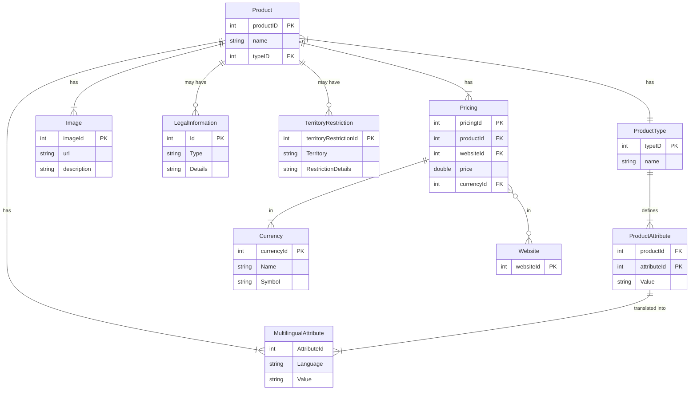

```mermaid

erDiagram

    Product {
        int productID PK
        string name
         int typeID FK
    }

    ProductType {
        int typeID PK
        string name
    }

    Image {
        int imageId PK
        string url
        string description
    }

    

    ProductAttribute {
        int productId FK
        int attributeId PK
        string Value
    }
    LegalInformation {
        int Id PK
        string Type
        string Details
    }
    MultilingualAttribute {
        int AttributeId
        string Language
        string Value
    }
    TerritoryRestriction {
        int territoryRestrictionId PK
        string Territory
        string RestrictionDetails
    }
    Pricing {
        int pricingId PK
        int productId FK
        int websiteId FK
        double price
        int currencyId FK
    }
    Currency {
        int currencyId PK
        string Name
        string Symbol
    }

    Website {
        int websiteId PK
    }

Product }|--|| ProductType : "has"
    Product ||--|{ MultilingualAttribute : "has"
    Product ||--|{ Image : "has"
    Product ||--o{ LegalInformation : "may have"
    Product ||--o{ TerritoryRestriction : "may have"
    Product ||--|{ Pricing : "has"
    ProductType ||--|{ ProductAttribute : "defines"
    ProductAttribute ||--|{ MultilingualAttribute : "translated into"
    Pricing ||--|{ Currency : "in"
    Pricing }o--o{ Website : "in"

```
