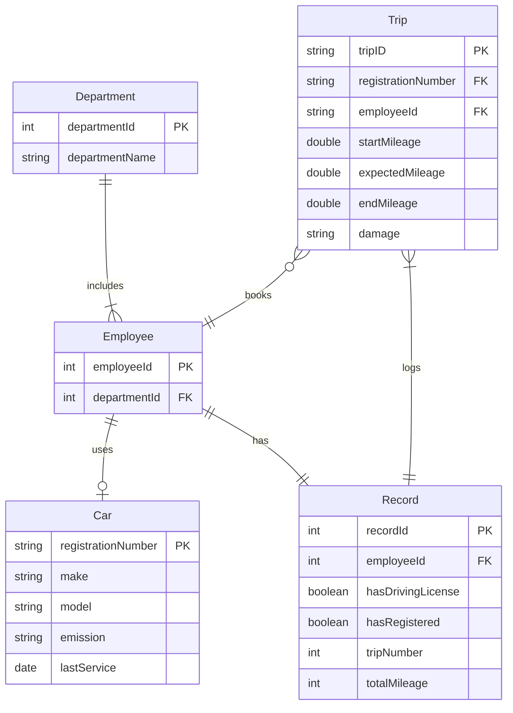

```mermaid
erDiagram

Car{
    string registrationNumber PK
    string make
    string model 
    string emission
    date lastService
}

Employee{
    int employeeId PK
    int departmentId FK
}

Department{
    int departmentId PK
    string departmentName
}

Department ||--|{ Employee : "includes"


Trip {
    string tripID PK
    string registrationNumber FK
    string employeeId FK
    double startMileage
    double expectedMileage
    double endMileage
    string damage
    }

Employee ||--o| Car : "uses"

Trip }o--|| Employee : "books"

Record {
    int recordId PK
    int employeeId FK
    boolean hasDrivingLicense
    boolean hasRegistered
    int tripNumber 
    int totalMileage
}

Employee ||--|| Record : has

Trip }|--|| Record : logs

```