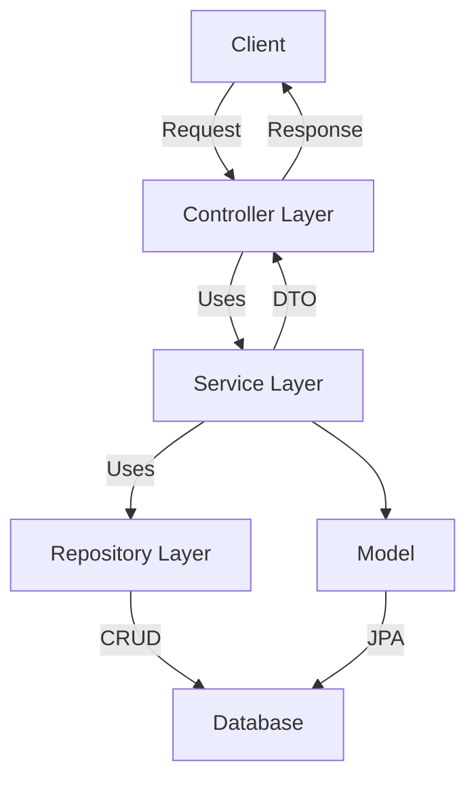

```mermaid
flowchart
    A[Client] -->|Request| B[Controller Layer]
    B -->|Response| A
    B -->|Uses| C[Service Layer]
    C -->|DTO| B
    C --> F[Model]
    C -->|Uses| D[Repository Layer]
    D -->|CRUD| E[Database]
    F --> |JPA| E
```

https://miro.medium.com/v2/resize:fit:1358/1*g0htFSEnplHtdXYcZG3qZQ.gif

##H2 console url: http://localhost:8080/h2-ui
##JDBC URL: jdbc:h2:file:./Rest

